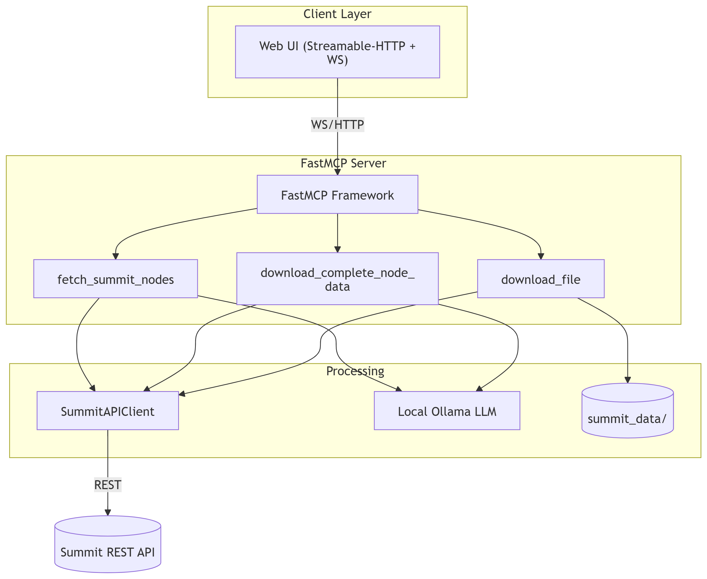

````markdown
# Summit MCP System

Offline-friendly toolkit for exploring Simon Fraser University’s **Summit** repository using a FastMCP server and a zero-build Web UI.



---

## ✨ Key Features
| Component            | Description                                                                              |
|----------------------|------------------------------------------------------------------------------------------|
| **FastMCP server**   | Exposes Summit utilities as callable tools (`fetch_summit_nodes`, `search_across_all_fields`, `download_file`, …). |
| **Web UI**           | One-file Flask app that auto-discovers tools via WebSocket (no node build step).          |
| **`download_file`**  | Retrieves a node’s primary **PDF** *and* its **JSON** metadata in one call.               |
| **Ollama integration** | Optional local LLM calls for summarisation / QA.                                       |
| **Offline caching**  | Once PDFs/JSON are cached under `summit_data/`, the stack works without internet.         |

---

## 🖥  Tested Environment
| Item     | Version / Notes           |
|----------|---------------------------|
| Python   | 3.11 (works on 3.9 - 3.12) |
| OS       | Windows 11 / Ubuntu 22.04 |
| FastMCP  | 0.4.x                     |
| Flask    | 3.x                       |
| Ollama   | 0.1.x (optional)          |

---

## 🚀 Quick Start (local)

### 1  Clone the repo
```bash
git clone https://github.com/<YOUR-ORG>/summit-mcp.git
cd summit-mcp
````

### 2  Create & activate a virtual-environment

<details>
<summary>Windows&nbsp;(PowerShell)</summary>

```ps1
python -m venv venv --copies
.\venv\Scripts\Activate.ps1
```

</details>

<details>
<summary>Linux / macOS</summary>

```bash
python3 -m venv venv
source venv/bin/activate
```

</details>

### 3  Install dependencies

```bash
pip install -r requirements.txt
```

*(Install Ollama separately if you want LLM tools, then run `ollama serve`.)*

### 4  Run the FastMCP server

```bash
python mcp_server_full.py            # → http://0.0.0.0:9000/mcp
```

### 5  Run the Web UI (2nd terminal)

```bash
python web_ui_full.py                # → http://localhost:8000
```

Open the browser → **Connect** → pick a tool → **Run**.

---

## 🛠  Using `download_file`

```jsonc
{
  "node_id": "12345",
  "max_size_mb": 50,
  "include_json": true
}
```

Result:

```json
{
  "node_id": "12345",
  "pdf_url": ".../paper.pdf",
  "pdf_saved_to": "summit_data/12345/paper.pdf",
  "pdf_size_bytes": 758312,
  "json_saved_to": "summit_data/12345/12345.json"
}
```

---

## 📂 Directory Layout

```
summit-mcp/
├─ mcp_server_full.py          # FastMCP server + tools
├─ web_ui_full.py              # Flask Web UI
├─ requirements.txt
├─ docs/                       # SVG / Mermaid assets
├─ summit_data/                # Cached PDFs & JSON
└─ README.md
```

---

## ⚙️ Configuration

Default settings live near the top of **`mcp_server_full.py`**:

```python
CONFIG = {
    "output_dir": Path("summit_data"),
    "database_path": Path("summit_data/metadata.db"),
    "max_file_size_mb": 50,     # PDF size limit
    "enable_ollama": True
}
```

Adjust paths / limits directly or refactor to read env-vars.

---

## 🛡 Deployment Options

| Strategy            | Command / Notes                                                                           |
| ------------------- | ----------------------------------------------------------------------------------------- |
| **Docker Compose**  | `docker compose up -d` (publishes 9000 & 8000)                                            |
| **Systemd service** | Copy `deploy/mcp.service` → `/etc/systemd/system/` then `sudo systemctl enable --now mcp` |
| **Windows Service** | Install [nssm](https://nssm.cc/) → `nssm install SummitMCP "python" "mcp_server_full.py"` |
| **Reverse Proxy**   | Place Nginx/Caddy in front for TLS + Auth                                                 |

---

## 📝 Design Docs

A detailed design document—Mermaid diagrams, sequence flows, error handling—lives in the repo’s Loop canvas: **“Summit MCP System Design Document.”**

---

## 🗃 .gitignore (suggested)

```
# Python artifacts
__pycache__/
*.py[cod]
*.log

# Virtual environments
venv*/
.env/
.venv/

# IDE / OS clutter
.vscode/
.idea/
.DS_Store
Thumbs.db

# Large generated data
summit_data/
ollama_models/
```

---

## 📡 Pushing to GitHub (if starting local → remote)

```bash
git init                    # if repo isn't already initialised
git add .
git commit -m "Initial commit – working Summit MCP stack"
git remote add origin https://github.com/<YOU>/summit-mcp.git
git branch -M main
git push -u origin main
```

---

## 🤝 Contributing

1. Fork & branch (`feat/<topic>`).
2. Code → **black** & **ruff** → add tests.
3. PR with a clear description.

---

## 🐾 License

MIT © 2025 **SFU**

```
